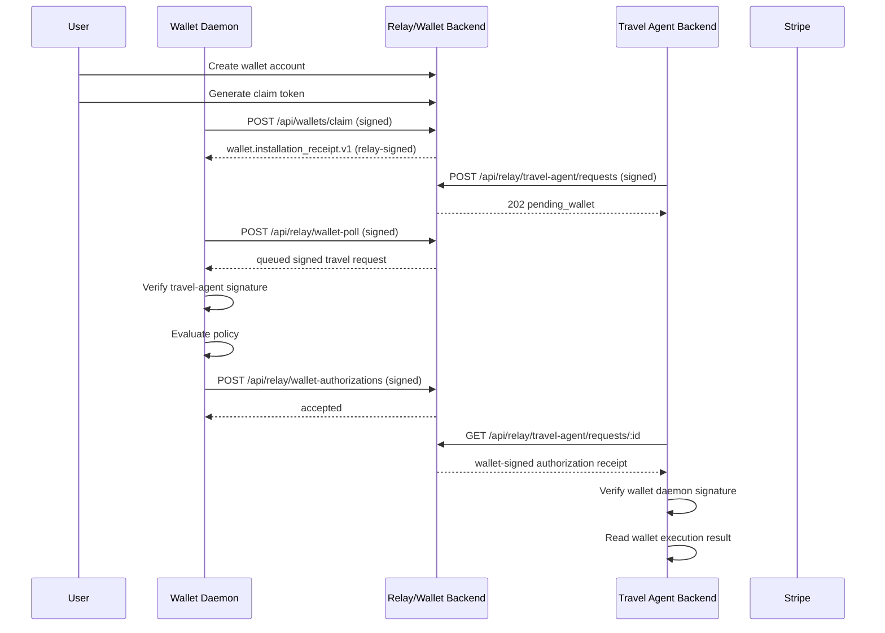

# Travel Agent Integration Contract

This document describes how the remote travel-agent backend talks to the user wallet in the current MVP wedge:

- local wallet daemon
- relay
- remote travel-agent backend
- wallet-side Stripe-style charge after wallet authorization

This is the contract to hand to the travel-agent coder.

## Current Status

This flow is implemented in the MVP server and covered by integration tests.

The recommended integration path is to use the packaged Countersign SDK:

Install it from GitHub in the travel-agent repo:

```bash
npm install github:WaltzOfWhispers/countersign
```

```js
import { createCountersignClient } from 'countersign';
```

Primary references:

- [src/app.js](/Users/christycui/Documents/agent_wallet/src/app.js)
- [src/sdk/index.js](/Users/christycui/Documents/agent_wallet/src/sdk/index.js)
- [src/lib/wallet-daemon-client.js](/Users/christycui/Documents/agent_wallet/src/lib/wallet-daemon-client.js)
- [test/wallet-daemon.integration.test.js](/Users/christycui/Documents/agent_wallet/test/wallet-daemon.integration.test.js)
- [test/wallet-daemon-client.integration.test.js](/Users/christycui/Documents/agent_wallet/test/wallet-daemon-client.integration.test.js)
- [test/countersign-sdk.integration.test.js](/Users/christycui/Documents/agent_wallet/test/countersign-sdk.integration.test.js)

## Roles

- `wallet account`
  The user-owned account in the wallet backend. This holds policy and balance.

- `wallet installation`
  The user’s local CLI/daemon install. It has its own Ed25519 keypair and signs wallet authorizations.

- `travel agent backend`
  The remote server-side business backend. It has its own Ed25519 keypair and signs relay requests.

- `relay`
  The message-routing layer inside the wallet server in this MVP. It verifies signatures, queues requests, and returns wallet-signed authorizations back to the travel agent.

## Trust Model

The travel agent does not talk directly to the user’s local daemon.

The flow is:

1. travel agent sends a signed authorization request to the relay
2. wallet daemon polls relay and verifies the travel-agent signature
3. wallet daemon signs an authorization receipt
4. if the wallet has a linked local payment method, the wallet also runs the Stripe-style charge
5. relay verifies the daemon signature and exposes the authorization result and charge result to the travel agent

Important:

- the relay does not sign wallet authorizations on behalf of the daemon
- the wallet daemon signs its own authorization receipt
- the travel agent signs its own enqueue requests
- the travel agent remains the merchant, but the wallet performs the charge on the travel agent's behalf in this MVP mode

## Onboarding

There are two separate onboarding paths.

### 1. Wallet daemon onboarding

The user:

1. creates a wallet account in the local agent wallet app or via MCP
2. generates a one-time claim token
3. installs the local daemon and gets a local keypair
4. claims the daemon to the wallet account

Claim endpoint:

- `POST /api/wallets/claim`

Signed payload:

```json
{
  "type": "wallet.claim.v1",
  "requestId": "wallet_claim_req_1",
  "walletInstallationId": "wallet_install_local_1",
  "walletAccountId": "user_123",
  "claimToken": "token_abc",
  "walletPubkey": "-----BEGIN PUBLIC KEY----- ...",
  "walletLabel": "CLI daemon",
  "timestamp": "2026-04-03T19:00:00.000Z",
  "nonce": "nonce_1"
}
```

Response:

```json
{
  "receipt": {
    "payload": {
      "type": "wallet.installation_receipt.v1",
      "requestId": "wallet_claim_req_1",
      "walletInstallationId": "wallet_install_local_1",
      "walletAccountId": "user_123",
      "status": "claimed",
      "relayKeyId": "key_...",
      "relayPubkey": "-----BEGIN PUBLIC KEY----- ...",
      "claimedAt": "2026-04-03T19:00:01.000Z"
    },
    "signature": "<base64url signature from relay key>"
  },
  "walletInstallation": {
    "id": "wallet_install_local_1",
    "ownerUserId": "user_123",
    "publicKeyPem": "-----BEGIN PUBLIC KEY----- ...",
    "label": "CLI daemon"
  }
}
```

### 2. Travel-agent backend onboarding

Current MVP behavior:

- the travel agent is pre-registered in server config as a trusted agent
- the server is initialized with a `trustedAgents` map keyed by `agentId`
- the travel agent must hold the private key matching the configured public key

MVP assumption:

- the travel agent backend already knows the target `walletAccountId`
- trusted agents can send payment requests to that wallet immediately
- the relay checks agent signature and wallet existence, then queues the request for the local runtime

### 3. Local payment method onboarding

The local wallet daemon can hold a Stripe payment-method reference.

If a payment method is linked locally, wallet approval can also execute the charge. If no payment method is linked, the relay request can still be approved, but no wallet-side charge will be executed unless the legacy capture path is used.

## Signing Rules

All signed payloads use:

- `Ed25519`
- canonical JSON with recursively sorted object keys
- `base64url` encoded signatures

Equivalent logic:

```js
function canonicalJsonStringify(value) {
  function sortValue(input) {
    if (Array.isArray(input)) return input.map(sortValue);
    if (input && typeof input === "object") {
      return Object.keys(input)
        .sort()
        .reduce((result, key) => {
          result[key] = sortValue(input[key]);
          return result;
        }, {});
    }
    return input;
  }

  return JSON.stringify(sortValue(value));
}
```

The server signs and verifies using that exact canonicalization. The travel-agent coder must match it.

## Travel Agent API Contract

The SDK wraps the raw HTTP contract below. In normal use, the travel-agent repo should call:

- `createCountersignClient({ baseUrl, agentId, privateKeyPem })`
- `enqueueAuthorizationRequest(...)`
- `getAuthorizationResult(...)`

The rest of this section is the wire contract the SDK speaks.

### A. Enqueue a payment authorization request

Endpoint:

- `POST /api/relay/travel-agent/requests`

Purpose:

- submit a signed payment authorization request to the relay for a specific wallet account

Required payload:

```json
{
  "type": "travel.payment_authorization_request.v1",
  "requestId": "travel_req_1",
  "agentId": "travel-agent",
  "walletAccountId": "user_123",
  "amount": {
    "currency": "USD",
    "minor": 2450
  },
  "bookingReference": "trip_123",
  "memo": "Flight booking charge",
  "timestamp": "2026-04-03T19:10:00.000Z",
  "nonce": "travel_nonce_1"
}
```

Request body:

```json
{
  "payload": {
    "...": "..."
  },
  "signature": "<base64url signature using the travel-agent private key>"
}
```

Successful response:

```json
{
  "relayRequestId": "travel_req_1",
  "walletInstallationId": "wallet_install_local_1",
  "status": "pending_wallet"
}
```

Meaning:

- relay accepted the request
- a claimed wallet installation exists for that wallet account
- the request is now waiting for the wallet daemon

If the agent is not trusted by the relay, the relay returns `403`.

### B. Retrieve wallet authorization result

Endpoint:

- `GET /api/relay/travel-agent/requests/:relayRequestId`

Purpose:

- read the current status of a relay request and fetch the wallet-signed authorization receipt

Successful response after wallet approval and charge:

```json
{
  "requestId": "travel_req_1",
  "status": "charged",
  "receipt": {
    "payload": {
      "type": "wallet.travel_authorization.v1",
      "relayRequestId": "travel_req_1",
      "walletInstallationId": "wallet_install_local_1",
      "walletAccountId": "user_123",
      "agentId": "travel-agent",
      "amount": {
        "currency": "USD",
        "minor": 2450
      },
      "bookingReference": "trip_123",
      "status": "approved",
      "reasonCode": "policy_passed",
      "authorizedAt": "2026-04-03T19:10:30.000Z",
      "nonce": "nonce_2"
    },
    "signature": "<base64url signature using the wallet daemon private key>"
  },
  "walletInstallation": {
    "id": "wallet_install_local_1",
    "ownerUserId": "user_123",
    "publicKeyPem": "-----BEGIN PUBLIC KEY----- ...",
    "label": "CLI daemon"
  },
  "execution": {
    "id": "charge_...",
    "provider": "stripe_wallet_charge",
    "providerReference": "pi_...",
    "status": "succeeded",
    "amountCents": 2450,
    "currency": "USD",
    "walletAccountId": "user_123",
    "agentId": "travel-agent",
    "relayRequestId": "travel_req_1",
    "paymentMethodId": "pm_...",
    "customerId": "cus_...",
    "cardBrand": "visa",
    "cardLast4": "4242",
    "createdAt": "2026-04-03T19:10:31.000Z"
  }
}
```

Travel-agent backend requirements:

- verify the signature on `receipt.payload` using `walletInstallation.publicKeyPem`
- only proceed if:
  - `status === "charged"` or `status === "authorized"` for the legacy path
  - `receipt.payload.status === "approved"`
  - signature verification passes
  - `walletAccountId`, `agentId`, `amount`, and `bookingReference` match the original request
  - if `execution` exists, treat that as the final wallet-run charge result and do not run a second Stripe charge from the travel agent

### C. Capture payment after authorization

Endpoint:

- `POST /api/relay/travel-agent/requests/:relayRequestId/capture`

Purpose:

- legacy fallback only
- tell the wallet backend that the travel agent is now capturing the payment through the Stripe rail when the wallet did not already execute the charge locally

Required payload:

```json
{
  "type": "travel.payment_capture.v1",
  "relayRequestId": "travel_req_1",
  "agentId": "travel-agent",
  "timestamp": "2026-04-03T19:10:45.000Z",
  "nonce": "travel_capture_nonce_1"
}
```

Successful response:

```json
{
  "charge": {
    "id": "charge_...",
    "provider": "mock_stripe_travel_charge",
    "providerReference": "pi_...",
    "status": "captured",
    "amountCents": 2450,
    "currency": "USD",
    "walletAccountId": "user_123",
    "agentId": "travel-agent",
    "relayRequestId": "travel_req_1",
    "createdAt": "2026-04-03T19:10:46.000Z"
  },
  "summary": {
    "...": "updated wallet summary"
  }
}
```

Preferred MVP behavior:

- do not use this endpoint when the wallet already returned an `execution` result
- the current architecture now prefers wallet-side execution when a local payment method is linked

## Wallet Daemon API Contract

The wallet daemon currently needs three behaviors.

### A. Claim itself

- `POST /api/wallets/claim`

### B. Poll relay

- `POST /api/relay/wallet-poll`

Signed payload:

```json
{
  "type": "wallet.relay_poll.v1",
  "walletInstallationId": "wallet_install_local_1",
  "timestamp": "2026-04-03T19:10:10.000Z",
  "nonce": "nonce_3"
}
```

Response:

```json
{
  "walletInstallationId": "wallet_install_local_1",
  "requests": [
    {
      "requestId": "travel_req_1",
      "payload": {
        "...": "travel authorization request payload"
      },
      "signature": "<base64url signature from travel agent>"
    }
  ]
}
```

The daemon must verify the request signature using the travel agent public key known to the relay-backed system.

### C. Submit authorization decision

- `POST /api/relay/wallet-authorizations`

Signed payload:

```json
{
  "type": "wallet.travel_authorization.v1",
  "relayRequestId": "travel_req_1",
  "walletInstallationId": "wallet_install_local_1",
  "walletAccountId": "user_123",
  "agentId": "travel-agent",
  "amount": {
    "currency": "USD",
    "minor": 2450
  },
  "bookingReference": "trip_123",
  "status": "approved",
  "reasonCode": "policy_passed",
  "authorizedAt": "2026-04-03T19:10:30.000Z",
  "nonce": "nonce_4"
}
```

Request body:

```json
{
  "payload": {
    "...": "..."
  },
  "signature": "<base64url signature from wallet daemon>"
}
```

The relay verifies that signature against the claimed wallet installation public key.

## Sequence Diagram



## What The Travel Agent Coder Must Implement

At minimum:

1. Hold a persistent Ed25519 keypair for the travel-agent backend.
2. Know the user’s `walletAccountId`.
3. Instantiate the Countersign SDK with the relay base URL, `agentId`, and private key.
4. Call:
   - `enqueueAuthorizationRequest(...)`
   - `getAuthorizationResult(...)`
5. Treat `execution` as the final wallet-run charge result when present.
6. Refuse any duplicate charging if the verified authorization fields do not match the original request.

## What Is Still Missing

These are known MVP gaps:

- no self-serve travel-agent registration yet
- no explicit user-to-travel-agent linking screen yet
- relay is polling, not a persistent daemon connection
- wallet-side charge uses real Stripe APIs when the user has linked a Stripe payment method
- replay protection is freshness-based plus request-id uniqueness, not a hardened distributed nonce service

## Recommended Next Implementation Step For Travel Agent Repo

Create a small booking-facing adapter around the packaged Countersign SDK so the booking flow only needs to think in terms of:

- request wallet authorization
- wait for wallet approval
- read the final wallet-run charge result

The SDK already owns:

- canonical JSON serialization
- Ed25519 signing
- wallet receipt verification
- relay endpoint calling

The travel-agent repo should still own field matching between the original booking request and the verified authorization result before marking the booking paid.
